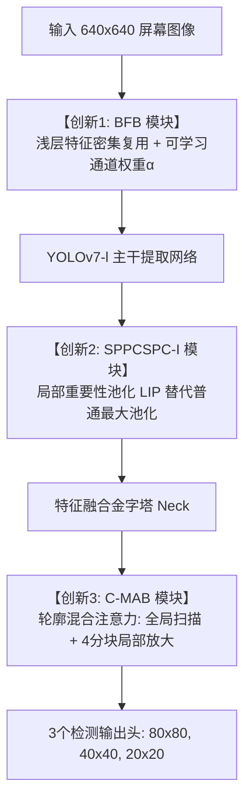

# 屏幕检测相关论文阅读报告

## 第一篇：SSGDD-YOLO（多尺度特征融合与多重注意力机制）

### 1.1 论文基本信息
* **论文标题**：*SSGDD-YOLO: Multiscale Feature Fusion and Multiattention-Based YOLO for Smartphone Screen Glass Defect Detection*
* **发表刊物**：IEEE Sensors Journal, Vol. 25, No. 4, 15 February 2025
* **作者团队**：Ping Wu, Haote Zhou, Yicheng Yu, Zengdi Miao, Qianqian Pan, Xi Zhang, Jinfeng Gao（浙江理工大学信息科学与工程学院）
* **基础框架**：基于 **YOLOv7-l** 架构进行工业级改进
* **论文源文件**：[SSGDD-YOLO.pdf](file:///c:/Users/cyz13/Documents/01_Projects/Screen_defect_detection/document/SSGDD-YOLO_Multiscale_Feature_Fusion_and_Multiattention-Based_YOLO_for_Smartphone_Screen_Glass_Defect_Detection.pdf)

---

### 1.2 背景与工业痛点

在智能手机屏幕玻璃盖板的流水线质检中，存在以下挑战：
1. **多尺度跨度极端**：缺陷尺寸覆盖微米级小目标（斑点、细微划痕）到大尺度区域性缺陷（裂纹、破损、油渍污斑），尺度方差极大。
2. **下采样导致的空间信息衰减**：深层卷积网络的逐级降采样（Stride Convolution / Pooling）会不断丢失浅层高频细节信息，导致微小目标漏检。
3. **长尾与弱对比度缺陷难以表征**：传统通用目标检测算法缺乏对玻璃均质背景与高对比边缘轮廓的专门建模能力，在污渍（Blot）等边界模糊、对比度微弱的类别上平均精度极低（近乎 0%）。

你可以把流水线质检员的工作想象成这样：
* 屏幕上的毛病千奇百怪：有的像**针尖灰尘**（斑点），有的像**细头发丝**（划痕），有的又是**大半个屏幕的一层淡淡油指纹**（污渍）。
* **普通 AI 为什么不好用？**
  * 原版 YOLO 看东西的习惯是“把一张大图拼命缩小抽水、看整体轮廓”。结果图一缩水，针尖大的小斑点直接被**抹平消失**了，后面再怎么找也找不着。
  * 对于淡淡的油污，原版 YOLO 根本看不出来，因为没有明显的黑白分界线，在以往的测试中，识别这种污渍的准确率基本就是 **0分**。

---

### 1.3 模型结构与三大核心创新点详解

为了克服上述缺陷，作者在 **YOLOv7-l** 的基础上设计了 **SSGDD-YOLO**，在网络的**入口处（Backbone浅层）**、**中枢金字塔（SPPCSPC）** 和 **输出增强层（Head）** 做了针对性改造：

---

#### 创新 1：分支融合模块 —— BFB (Branch Fusion Block)

  * **结构位置**：嵌入在主干网络（Backbone）的最前端。
  * **机制原理**：借鉴 DenseNet 的密集连接思想，构建 `DenseCBS` 单元（通过 $1\times1$ 卷积降维、跨层短接复用特征再由 $1\times1$ 输出），保持原始浅层空间分布。
  * **特征张量定义与空间尺度**：
    设网络输入图像张量为 $X \in \mathbb{R}^{C_{in} \times H \times W}$（分辨率 $640\times 640$），通过并行的密集连接结构分别构建三个尺度的浅层特征底图：
    * $Z_1 = \text{DenseCBS}_1(X) \in \mathbb{R}^{C \times H \times W}$（$640\times 640$，包含最高频的空间几何纹理）
    * $Z_2 = \text{DenseCBS}_2(X) \in \mathbb{R}^{2C \times \frac{H}{2} \times \frac{W}{2}}$（$320\times 320$，兼顾中尺度空间与语义）
    * $Z_3 = \text{ELAN}(f(X)) \in \mathbb{R}^{8C \times \frac{H}{4} \times \frac{W}{4}}$（$160\times 160$，感受野更大）

  * **核心数学公式与逐级运算机理**：
    $$\begin{aligned}
    Z_4 &= \text{Concat}(\text{CBS}(Z_1), \text{AvgPool}(Z_1)) \\
    Z_5 &= Z_4 \odot \alpha_1 + Z_2 \\
    Y &= \text{AvgPool}(\text{CBS}(Z_5)) \odot \alpha_2 + Z_3
    \end{aligned}$$

    1. **异构双路下采样与通道拼接（公式 1）**：
       * $\text{CBS}(Z_1)$：以步长 $\text{stride}=2$ 实施 $3\times 3$ 卷积，提取变换后的高频空间边缘；
       * $\text{AvgPool}(Z_1)$：以步长 $\text{stride}=2$ 实施局部平均池化，保留平滑的全局均值背景分布；
       * $\text{Concat}(\cdot)$：在通道维度拼接两路异构下采样特征，形成融合张量 $Z_4 \in \mathbb{R}^{2C \times \frac{H}{2} \times \frac{W}{2}}$，实现纹理细节与背景分布的互补。
    2. **通道自适应重标定与跨尺度残差注入（公式 2）**：
       * 引入可学习参数向量 $\alpha_1 \in \mathbb{R}^{2C \times 1 \times 1}$，$\odot$ 表示沿通道维度的广播逐元素乘积（Broadcast Hadamard Product）；
       * 将经过重要性重加权的浅层特征，与中尺度基准特征 $Z_2$ 进行按元素残差相加（Element-wise Addition），输出强化特征图 $Z_5$。
    3. **二阶级联下采样与深层语义对齐（公式 3）**：
       * 对 $Z_5$ 再次执行 stride=2 的卷积与池化降采样，将空间尺寸降至 $160\times 160$；
       * 乘以第二组可学习权重 $\alpha_2 \in \mathbb{R}^{8C \times 1 \times 1}$ 再次完成通道特征响应校准；
       * 最终与最深层语义特征 $Z_3$ 残差相加，生成最终的融合表征 $Y \in \mathbb{R}^{8C \times \frac{H}{4} \times \frac{W}{4}}$。

  * **“自学习”（Learnable Mechanism）的数学本质与优化机理**：
    * **参数属性**：$\alpha_1, \alpha_2$ 在 PyTorch 中实例化为网络权重参数 `nn.Parameter`。它不是人工先验设定的经验超参数，也不是传统注意力模块（如 SE/CBAM）中依赖前向输入动态计算的样本依赖权重（Instance-dependent），而是**刻画全局缺陷特征空间分布的可微先验向量（Task-level Global Prior Parameter）**。
    * **梯度反向传播机制**：
      设最终目标检测的多任务损失函数为 $\mathcal{L} = \mathcal{L}_{\text{box}} + \mathcal{L}_{\text{cls}} + \mathcal{L}_{\text{obj}}$。在反向传播阶段，根据链式求导法则，损失 $\mathcal{L}$ 对权重向量 $\alpha_1$ 的第 $c$ 个通道分量 $\alpha_1^{(c)}$ 的梯度为：
      $$\frac{\partial \mathcal{L}}{\partial \alpha_1^{(c)}} = \sum_{h=1}^{H/2} \sum_{w=1}^{W/2} \left( \frac{\partial \mathcal{L}}{\partial Z_5^{(c, h, w)}} \cdot Z_4^{(c, h, w)} \right)$$
      基于随机梯度下降算法（SGD），参数以学习率 $\eta$ 进行自主迭代更新：
      $$\alpha_1^{(c)} \leftarrow \alpha_1^{(c)} - \eta \frac{\partial \mathcal{L}}{\partial \alpha_1^{(c)}}$$
    * **物理行为表现**：
      * **有效特征自增益**：若第 $c$ 个通道提取到了高判别性的细微划痕或斑点响应，梯度反向更新会自发增大 $\alpha_1^{(c)}$，放大该通道向深层的传递增益；
      * **背景噪声自衰减**：若第 $c$ 个通道捕获的是屏幕反光、铝箔高亮等干扰伪影，梯度会自发促使 $\alpha_1^{(c)}$ 衰减收敛向 0，起到强行抑制噪声、过滤误报的作用。
    * **工程优势**：相比外挂复杂的注意力子网络，该机制仅引入微量的一维参数（$2C$ 和 $8C$ 个浮点数），前向计算耗时几乎为零，却为跨尺度特征融合提供了端到端的自适应通道通道重校准能力。

---

#### 创新 2：局部重要性池化金字塔 —— SPPCSPC-I

  * **结构位置**：位于主干网络（Backbone）末端与特征融合金字塔（Head）连接的枢纽节点。
  * **机制原理**：原版 YOLOv7 的 SPPCSPC 融合了空间金字塔池化（SPP）与跨阶段局部网络（CSPC），其多感受野分支使用固定窗口的标准最大池化（Max Pooling）。本文提出 **SPPCSPC-I**，将所有硬性最大池化替换为**可学习局部重要性池化（LIP, Local Importance-based Pooling）**，引入可微分的轻量卷积子网络自适应学习空间局部重要性权重。
  * **特征张量定义与空间尺度**：
    设输入 SPPCSPC-I 的特征图为 $I \in \mathbb{R}^{C_{in} \times H \times W}$（如深层尺度 $512 \times 20 \times 20$）：
    * 并行金字塔池化分支采用不同感受野尺度的滑动窗口（如 $k=5\times 5, 9\times 9, 13\times 13$），在保持空间分辨率的同时捕获多尺度上下文；
    * 每个局部滑动窗口定义为局部邻域 $\Omega$；
    * 内部生成的重要性未归一化打分图为 $g(I) \in \mathbb{R}^{C_{in} \times H \times W}$；
    * 指数映射后的非负权重张量为 $F(I) \in \mathbb{R}^{C_{in} \times H \times W}$；
    * 池化加权聚合后输出张量为 $O \in \mathbb{R}^{C_{in} \times H \times W}$。

  * **核心数学公式与逐级运算机理**：
    $$\begin{aligned}
    F(I) &= \exp(g(I)) \\
    O_{x',y'} &= \frac{\sum_{(\Delta x, \Delta y)\in \Omega} F(I)_{x+\Delta x, y+\Delta y} \cdot I_{x+\Delta x, y+\Delta y}}{\sum_{(\Delta x, \Delta y)\in \Omega} F(I)_{x+\Delta x, y+\Delta y}}
    \end{aligned}$$

    1. **特征重要性打分图生成（公式 4）**：
       * $g(\cdot)$ 由轻量可学习卷积层（含深度可分离卷积与 BatchNorm）构成，提取局部空间与通道关联，输出连续打分图 $g(I)$；
       * $\exp(\cdot)$ 为指数函数映射，将实数得分映射为严格正数（$F(I) > 0$），既保障了分母非零防止除零异常，又使得该操作在数学形式上等价于局部空间软注意力（Local Spatial Softmax）。
    2. **局部归一化加权平均池化（公式 5）**：
       * 分子项 $\sum F(I) \cdot I$：计算邻域 $\Omega$ 内所有像素基于其重要性得分的加权求和，重点放大关键瑕疵特征的贡献；
       * 分母项 $\sum F(I)$：计算邻域内所有像素的总权重得分，作为归一化因子（保证各格点相对权重之和恒为 1，杜绝数值发散与尺度偏移）；
       * 最终输出 $O_{x',y'}$ 实现了兼顾多尺度感受野的“自适应价值聚合”，彻底克服了最大池化对反光噪点的盲从和平均池化对细微瑕疵的过度稀释。

  * **“端到端无监督自学习”的数学本质与优化机理**：
    * **参数属性**：打分网络 $g(I; \Theta_g)$ 内部的卷积核权重 $\Theta_g$ **不需要任何人工标注的重要性标签（Ground Truth）**，而是直接受检测多任务总损失 $\mathcal{L} = \mathcal{L}_{\text{box}} + \mathcal{L}_{\text{cls}} + \mathcal{L}_{\text{obj}}$ 端到端联合反向传播驱动。
    * **梯度反向传播机制**：
      对商式求导（Quotient Rule），输出 $O$ 对局部窗口内第 $k$ 个像素的权重 $F_k$ 的偏导数为：
      $$\frac{\partial O_{x',y'}}{\partial F_k} = \frac{I_k \sum_{j} F_j - \sum_{j} F_j I_j}{\left(\sum_{j} F_j\right)^2} = \frac{I_k - O_{x',y'}}{\sum_{j} F_j}$$
      根据链式求导法则，损失 $\mathcal{L}$ 对打分卷积参数 $\Theta_g$ 的反向更新梯度为：
      $$\frac{\partial \mathcal{L}}{\partial \Theta_g} = \sum_{\Omega} \left( \frac{\partial \mathcal{L}}{\partial O} \cdot \frac{I_k - O}{\sum F} \cdot F_k \cdot \frac{\partial g(I)_k}{\partial \Theta_g} \right)$$
      **梯度行为表现**：偏导数直接正比于 $(I_k - O)$！
      * **有效缺陷特征自增强**：当像素 $I_k$ 携带有判别力极高的缺陷特征时（$I_k > O$），增大该像素的权重 $F_k$ 会使输出 $O$ 更贴近缺陷；若这降低了总损失 $\mathcal{L}$，反向传播就会推动 $\Theta_g$ 在后续前向中给予此类特征更高的 $g(I)$ 得分；
      * **背景噪点与伪影自抑制**：当像素 $I_k$ 是玻璃表面的反光伪影或无意义噪点时，误检造成的损失惩罚会迫使参数反向更新，自发打出极低的 $g(I)$ 分数将其滤除。
    * **工程优势**：相比纯视觉 Transformer 昂贵的自注意力计算，LIP 仅需轻量级滑动卷积与局部聚合，在几乎不增加推理延迟（Latency）的前提下，使 SPP 金字塔具备了抗反光噪点、精准保留微弱瑕疵的动态多感受野融合能力。

  * **生活比喻与工业应用直觉**：
    * **原生最大池化（Max Pooling）**：像一个粗暴的评委——“谁嗓门大、谁反光刺眼就选谁”。屏幕表面一旦有强烈的铝箔反光噪点，AI 就被带偏。
    * **换成 LIP 之后**：给池化窗口配了一名“懂打分的智能评审团”。每个像素不是单纯比绝对数值大小，而是经过网络综合打分后按权重比例折算。高光反光被主动压低，真正的缺陷核心特征被保留。

---

#### 创新 3：轮廓混合注意力模块 —— C-MAB (Contour-Mixed Attention Block)

  * **结构位置**：部署在特征融合金字塔（Neck/Head）的多尺度特征增强与输出检测头的前级。
  * **机制原理**：针对手机屏幕背景高度均匀单调、但缺陷尺度方差极大（微米级斑点/细划痕 vs 大面积污斑/破损）的极端工业场景，提出**空间双路解耦（全局长程轮廓 + 4 分块局部高频）+ 通道加和 + 残差直连（Residual）**的混合注意力机制。
  * **特征张量定义与空间尺度**：
    设送入 C-MAB 模块的输入特征张量为 $X \in \mathbb{R}^{C \times H \times W}$：
    * 全局轮廓向量：$H' \in \mathbb{R}^{C \times H \times 1}$（高维度坐标轮廓），$W' \in \mathbb{R}^{C \times 1 \times W}$（宽维度坐标轮廓）；
    * 田字格分块张量：$x_i = \text{Chunk}(X) \in \mathbb{R}^{C \times \frac{H}{2} \times \frac{W}{2}} \quad (i=1, 2, 3, 4)$；
    * 通道标定权重向量：$Ch \in \mathbb{R}^{C \times 1 \times 1}$；
    * 最终输出特征张量：$Y \in \mathbb{R}^{C \times H \times W}$。

  * **核心数学公式与逐级运算机理**：
    $$\begin{aligned}
    H' &= \text{Softmax}(\text{Mean}_H(X)), \quad W' = \text{Softmax}(\text{Mean}_W(X)) \\
    Sp_1 &= \text{Conv2d}(H' \otimes X \otimes W') \\
    x_i &= \text{Chunk}(X), \quad h'_i = \text{Softmax}(\text{Max}_H(x_i)), \quad w'_i = \text{Softmax}(\text{Max}_W(x_i)) \\
    sp_i &= \text{Conv2d}(h'_i \otimes x_i \otimes w'_i), \quad (i=1, 2, 3, 4) \\
    Sp_2 &= \text{Conv2d}(\text{Concat}(sp_1, sp_2, sp_3, sp_4)) \\
    ch_1 &= \text{MLP}(\text{AdaptiveAvg}(X)), \quad ch_2 = \text{MLP}(\text{AdaptiveMax}(X)) \\
    Ch &= \text{Sigmoid}(ch_1 + ch_2) \\
    Y &= X_{\text{residual}} + Sp_1 + Sp_2 + Ch
    \end{aligned}$$

    1. **全局空间轮廓分支 $Sp_1$（公式 6）——“宏观望远镜”**：
       * 分别沿水平（$W$）与垂直（$H$）维度执行全局平均池化（$\text{Mean}_H, \text{Mean}_W$），经 Softmax 归一化后保留了精准的长程位置感知；
       * **为什么用 Mean？** 均匀的屏幕背景下，大面积污渍（Blot）或宏观裂纹边缘没有剧烈的局部突变，全局平均能滤除局部细微杂波，平滑提取长程宏观明暗轮廓分布；
       * 与输入张量 $X$ 广播相乘后经 $1\times 1$ 卷积，生成全局空间表征 $Sp_1 \in \mathbb{R}^{C \times H \times W}$。
    2. **局部空间高频分支 $Sp_2$（公式 7、8）——“微观放大镜”**：
       * 利用 `Chunk` 操作将空间切分为 4 个局部象限（左上 $x_1$、左下 $x_2$、右上 $x_3$、右下 $x_4$）；
       * 在每个象限内，沿行/列执行**局部最大值池化（$\text{Max}_H, \text{Max}_W$）**，求得局部高频响应 $h'_i, w'_i$ 并调制子图生成 $sp_i$；
       * **为什么用 Max + Chunk？** 针尖大的小黑点（Spot）或极细划痕（Scratch）如果全图平均会被瞬间稀释；而在局部象限内求极值，能瞬间锁死最锐利的突变边缘。分块切分还防止了全图唯一噪点对其他象限真实缺陷的“注意力遮蔽”；
       * 将 4 个局部特征图在空间维度拼接（Concat），经卷积融合重构为 $Sp_2 \in \mathbb{R}^{C \times H \times W}$。
    3. **通道自适应校准分支 $Ch$（公式 9）——“通道调音台”**：
       * 借鉴 CBAM 设计，结合全局自适应平均与最大池化，压缩空间维度后通过共享双层 MLP 建模通道间相互依赖；
       * 经 Sigmoid 输出 $0\sim 1$ 的通道增益向量 $Ch$，负责自主强化缺陷敏感通道、抑制环境伪影通道。
    4. **并行加法融合与残差直连（公式 10 扩展）**：
       * 传统注意力通常采用“串行逐元素相乘”；而 C-MAB 采用**空间多尺度解耦 + 通道解耦的并行独立提取**，并以**残差直连与逐元素相加（Addition）**汇聚：$Y = X_{\text{residual}} + Sp_1 + Sp_2 + Ch$；
       * **避免微弱特征衰减**：在深层网络中，微弱缺陷特征经不起多次小于 1 的权重连乘（乘法会导致微弱信号指数级衰减甚至归零），并行加法能完整保留各分支互补的判别信息。

  * **学术验证与对比实验表现（Table II）**：
    * 在与 SE, SK, CBAM, CA, PSA, EMA 六大经典注意力的横向测评中，C-MAB 综合 $AP$ 达到 **32.50%**，在所有注意力中夺冠；
    * **大目标爆发式提升**：大尺度缺陷指标 $AP_L$ 飙升至 **47.60%**（相比 baseline 提升整整 **10.1%**），直接印证了 $Sp_1$ 分支抓取大面积轮廓油污的有效性；同时在小目标 $AP_S$ 上达到 39.00%，兼顾了微观与宏观缺陷。

  * **生活比喻与工业应用直觉**：
    * 给质检员装上一双**“智能复合眼”**：
      1. **一只眼装望远镜（宏观全局扫描）**：专门扫视整张玻璃的大范围明暗渐变，抓**大片淡淡的油污（Blot）和崩边（Broken）**；
      2. **一只眼装显微镜（四分区微观放大）**：把屏幕分成“田字格”4 块，每块单独放大找最刺眼的局部轮廓突变，抓**细微划痕（Scratch）和小斑点（Spot）**；
      3. **一只耳朵听调音台（通道权重）**：把缺陷声音放大，把流水线反光杂音静音；
      4. **最后把多重感知加权叠加，配合底图残差直连**，做到“大缺陷不漏看，小缺陷跑不掉”。

---

### 1.4 工业数据集与实验设置

* **数据集名称**：SSGD (Smartphone Screen Glass Dataset)
* **采集来源**：真实工业触摸屏流水线，由工业线阵相机拍摄，黑色暗场背景以减弱环境光散射。
* **数据规模**：共 2504 张，本实验精选 956 张典型图像（按 8:1:1 划分为训练集、验证集、测试集）。
* **6 类典型工业缺陷**：
  1. `Spot`（斑点/点状缺陷）
  2. `Scratch`（划痕）
  3. `Broken`（破损/崩边）
  4. `Crack`（裂纹）
  5. `Broken-membrane`（破膜）
  6. `Blot`（污渍/油污）
* **图像预处理**：针对部分屏幕后衬铝箔纸的反光干扰，预先采用轻量 **Unet** 网络进行铝箔背景的智能分割与剔除。
* **训练环境与超参数**：
  * GPU：NVIDIA RTX 3090 (24GB) / PyTorch 3.8
  * 分辨率：$640 \times 640$；Batch Size：8
  * 优化器：SGD（动量 0.937，初始学习率 0.01，余弦退火衰减 CosineAnnealingLR）
  * 数据增强：Mosaic（前 70% Epochs 开启，50% 概率） + MixUp（50% 概率）；总轮数 100 Epochs。

---

### 1.5 运行精度与性能指标全览

#### 1. 与国际主流/经典模型对比结果 (SOTA Comparison)

| 检测模型 | 模型架构类型 | Spot (斑点) | Broken (破损) | Scratch (划痕) | Crack (裂纹) | Broken-mem (破膜) | **Blot (污渍)** | **mAP (%) [总综合精度]** | 参数量 (M) | 速度 (FPS) |
| :--- | :--- | :---: | :---: | :---: | :---: | :---: | :---: | :---: | :---: | :---: |
| Faster R-CNN | 两阶段经典 | 0.07% | 46.14% | 28.13% | 44.34% | 28.53% | 1.61% | **24.80%** | 136.79 | 7.61 |
| RetinaNet | 一阶段经典 | 0.00% | 46.12% | 37.10% | 49.13% | 43.33% | 0.00% | **37.61%** | 36.43 | 17.22 |
| YOLOv3 | 单阶段先驱 | 61.13% | 49.15% | 57.44% | 46.63% | 27.78% | 0.00% | **40.35%** | 61.55 | 37.17 |
| YOLOv5-l | 工业主流基准 | 69.23% | 68.59% | 79.75% | 38.41% | 33.33% | 0.00% | **48.22%** | 46.66 | 19.83 |
| YOLOv8-l | SOTA基准 | 62.68% | 66.38% | 74.45% | 33.09% | 33.33% | 0.00% | **53.32%** | 43.63 | 15.82 |
| YOLOX-l | 无锚框代表 | 67.39% | **79.29%** | 80.25% | 49.26% | 33.33% | 6.25% | **52.63%** | 54.15 | 16.21 |
| PP-YOLOE+-l | 百度工业模型 | 39.27% | 35.01% | 54.19% | **55.43%** | 31.48% | 34.07% | **25.42%** | 51.30 | 31.45 |
| **SSGDD-YOLO (本文)** | **本文改进模型** | **77.92%** | 74.56% | **80.76%** | 49.86% | **41.67%** | **50.00%** | **62.46%** | **48.93** | **14.81** |

#### 【数据表现亮点与白话解读】
1. **综合准确率绝对第一（62.46% mAP）**：
   * 比没有改进的原版 YOLOv7 提升了 **+12.21%**。
   * 比业界鼎鼎大名的 YOLOv8-l 高出了 **+9.14%**，比 YOLOv5-l 高出了 **+14.24%**。
2. **彻底攻克了“污渍（Blot）”这只拦路虎**：
   * 看表中的 Blot 一列：YOLOv3、v4、v5、v8 全都是 **0.00%**（完全无能为力）；而本文的 SSGDD-YOLO 直接飙升到了 **50.00%**，这就是 C-MAB 全局轮廓扫描和 BFB 浅层调权的功劳！
3. **点状和划痕精度极高**：
   * 斑点（Spot）达到 **77.92%**，划痕（Scratch）达到 **80.76%**，均为全场最优。
4. **运行速度与实用性（FPS）**：
   * 推理速度为 **14.81 帧/秒（FPS）**，参数量 **48.93M**。虽然相比轻量模型略重一点点，但在工业流水线上配合工控机 RTX 3090/4090 完全能够胜任实时传送带检测。

---

### 1.6 消融实验验证（拆开看每个绝招管不管用）

作者在论文中做了一组非常严密的“拆装拆件对比”（消融实验），验证三个模块到底谁起了关键作用：

| 实验组别 | BFB (浅层融合) | SPPCSPC-I (LIP池化) | C-MAB (轮廓混合注意力) | mAP (%) | 精度变化 |
| :--- | :---: | :---: | :---: | :---: | :---: |
| 原始基线 (YOLOv7) | ✕ | ✕ | ✕ | 50.25% | 基准线 |
| 单加 BFB | ✔ | ✕ | ✕ | 56.37% | **+6.12%** |
| 单加 SPPCSPC-I | ✕ | ✔ | ✕ | 59.72% | **+9.47%** |
| 单加 C-MAB | ✕ | ✕ | ✔ | 59.53% | **+9.28%** |
| 加 BFB + C-MAB | ✔ | ✕ | ✔ | 60.33% | **+10.08%** |
| **完整 SSGDD-YOLO** | ✔ | ✔ | ✔ | **62.46%** | **+12.21%** |

* **结论**：任何一个模块单独装上去，都能直接给模型带来 **6% 到 9.5%** 的飞跃；当三者全部合体时，产生协同效应，最终提升了 **12.21%**。

---

### 1.7 工业落地启示与总结

对于我们当前实际正在推进的屏幕缺陷检测系统，这篇论文具有极强的**代码复现与工程迁移价值**：

1. **工业单调背景质检的“降维打击”法则**：
   * 通用 CV（如 COCO 数据集）讲求抗自然背景杂乱；但工业屏幕的背景其实很均匀。此时**不要盲目上昂贵的纯视觉 Transformer**，像本文 C-MAB 这样利用简单的 `mean`、`max` 和 `chunk` 进行轮廓提炼，算力小、性价比极高。
2. **改动轻量却效果显著的“换池化”技巧**：
   * 在类似 YOLOv5 / YOLOv8 / YOLOv11 的代码中，将主干末端的 SPP/SPPF 里面的 `nn.MaxPool2d` 替换为可学习的 `LIP` 模块，几乎不增加推理耗时，却能显著提升微小缺陷的抗噪能力。
3. **浅层细节保留胜过深层弥补**：
   * 一旦小缺陷在前几个卷积层被抹平，后面再怎么做特征金字塔（FPN/PANet）都无法凭空变出信息。像 BFB 这样在网络最入口阶段进行多尺度保留与通道加权，是提高微细划痕/微尘斑点召回率的制胜招式。
